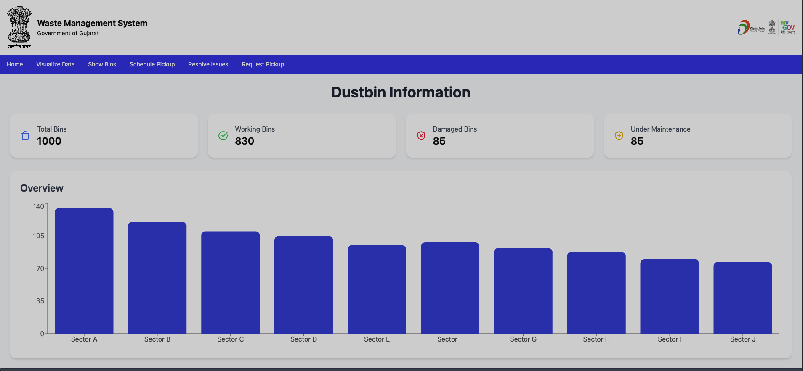
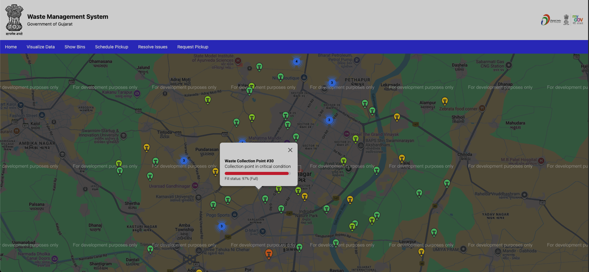
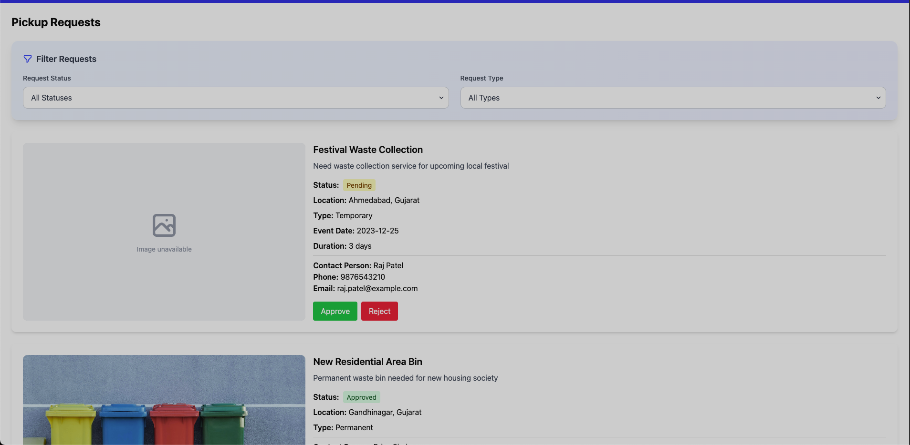
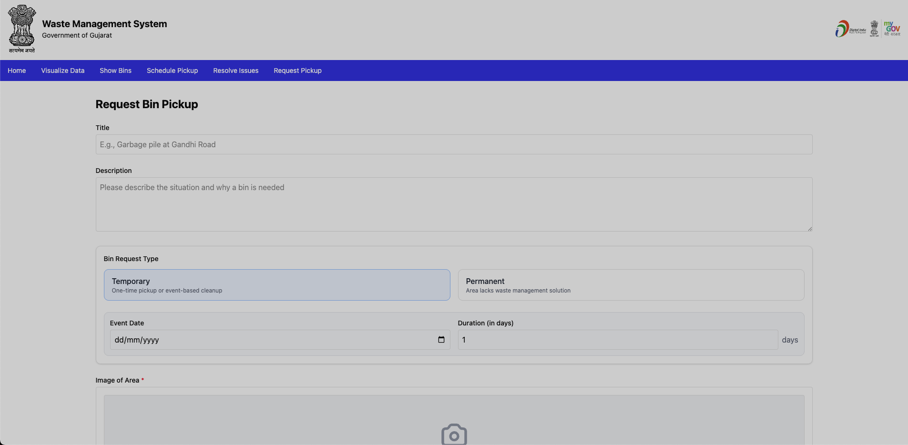
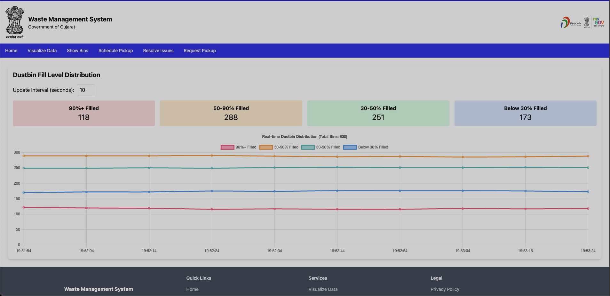

# Smart Dustbin Management System 🗑️

A comprehensive waste management solution built for **SSIP Gujarat 2025** hackathon. This application provides real-time monitoring of smart dustbins, complaint management, pickup scheduling, and data visualization for efficient waste management in urban areas.

## 🌟 Features

### Public Features

- **🗺️ Dustbin Location Map**: Interactive map showing all dustbin locations with real-time status
- **📋 Complaint Management**: Citizens can report waste-related issues with image uploads
- **📊 Information Dashboard**: Public access to waste management statistics and information

### Admin Features (Protected)

- **🏠 Admin Dashboard**: Comprehensive overview of the waste management system
- **🔧 Dustbin Management**: Monitor and manage dustbin status, capacity, and maintenance
- **🚛 Pickup Scheduling**: Schedule and track waste collection routes
- **⚠️ Complaint Resolution**: Review and resolve citizen complaints
- **📈 Data Visualization**: Analytics and insights on waste collection patterns

## 🛠️ Tech Stack

- **Frontend**: React 19 + TypeScript
- **Build Tool**: Vite
- **Styling**: Tailwind CSS + TailwindCSS Animate
- **UI Components**: Radix UI primitives
- **Icons**: Lucide React
- **Maps**: Google Maps API
- **Charts**: Recharts + Chart.js
- **State Management**: Zustand
- **Forms**: React Hook Form
- **HTTP Client**: Axios
- **Animations**: Framer Motion
- **Notifications**: React Toastify
- **Routing**: React Router DOM

## 🚀 Getting Started

### Prerequisites

- **Node.js** (v18 or higher)
- **Bun** runtime (recommended) or npm/yarn
- **Google Maps API Key**

### Installation

1. **Clone the repository**

   ```bash
   git clone https://github.com/SurajAiri/ssip_gujarat_dustbin_25.git
   cd ssip_gujarat_dustbin_25
   ```

2. **Install dependencies**

   ```bash
   bun install
   # or
   npm install
   ```

3. **Environment Setup**

   ```bash
   cp example.env .env
   ```

   Configure your environment variables in `.env`:

   ```env
   VITE_GOOGLE_MAPS_API_KEY=your_google_maps_api_key
   VITE_API_BASE_URL=your_backend_api_url
   ```

4. **Start the development server**

   ```bash
   bun dev
   # or
   npm run dev
   ```

5. **Open your browser**
   Navigate to `https://ssip-gujarat.netlify.app/`

### preview:

<!-- 
_Admin Dashboard - Comprehensive waste management overview_ -->


_Interactive Dustbin Location Map with real-time status_

<table>
  <tr>
    <td align="center" width="50%">
      <br/>
      <strong>Admin Dashboard</strong><br/>
      Comprehensive waste management overview
    </td>
    <td align="center" width="50%">
      <br/>
      <strong>Pickup Scheduling</strong><br/>
      Efficient route planning and management
    </td>
  </tr>
  <tr>
    <td align="center" width="50%">
      <br/>
      <strong>Request Management</strong><br/>
      Streamlined complaint handling system
    </td>
    <td align="center" width="50%">
      <br/>
      <strong>Data Visualization</strong><br/>
      Analytics and insights dashboard
    </td>
  </tr>
</table>

## 📝 Available Scripts

```bash
bun dev          # Start development server
bun build        # Build for production
bun preview      # Preview production build
bun lint         # Run ESLint
```

## 🏗️ Project Structure

```
src/
├── apis/                 # API client and authentication
├── components/           # Reusable UI components
│   └── ui/              # Radix UI component implementations
├── controllers/          # Business logic controllers
├── features/            # Feature-based modules
│   ├── auth/            # Authentication screens
│   ├── complaint/       # Complaint management
│   ├── general/         # Public screens (home, info, etc.)
│   └── map/             # Map-related features
├── lib/                 # Utility libraries
├── stores/              # Zustand state stores
├── types/               # TypeScript type definitions
└── utils/               # Helper functions and constants
```

## 🔐 Authentication

The application uses role-based access control:

- **Public Routes**: Landing page, dustbin map, complaint submission
- **Protected Routes**: Admin dashboard, dustbin management, complaint resolution

## 🗺️ Core Components

### Dustbin Management

- Real-time monitoring of dustbin fill levels
- Status tracking (active, maintenance, full)
- Location-based organization
- Capacity management

### Complaint System

- Image upload support
- Category-based classification
- Status tracking (pending, in-progress, resolved)
- Contact information management

### Visualization Dashboard

- Fill level analytics
- Collection route optimization
- Historical data trends
- Performance metrics

## 🎨 UI/UX Features

- **Responsive Design**: Mobile-first approach with Tailwind CSS
- **Accessibility**: ARIA-compliant components using Radix UI
- **Dark/Light Mode**: Theme switching capability
- **Interactive Maps**: Google Maps integration with custom markers
- **Smooth Animations**: Framer Motion for enhanced user experience

## 🔧 Development Guidelines

### Code Style

- TypeScript for type safety
- ESLint configuration for code quality
- Component-based architecture
- Feature-based folder structure

### State Management

- Zustand for global state
- Local state for component-specific data
- Persistent storage for user preferences

## 🤝 Contributing

1. Fork the repository
2. Create a feature branch (`git checkout -b feature/amazing-feature`)
3. Commit your changes (`git commit -m 'Add amazing feature'`)
4. Push to the branch (`git push origin feature/amazing-feature`)
5. Open a Pull Request

## 📄 License

This project is developed for SSIP Gujarat 2025 hackathon.

## 🏆 SSIP Gujarat 2025

This project is submitted as part of the Student Startup and Innovation Policy (SSIP) Gujarat 2025 initiative, focusing on innovative solutions for smart city waste management.

---

**Built with ❤️ for a cleaner, smarter future** 🌱
